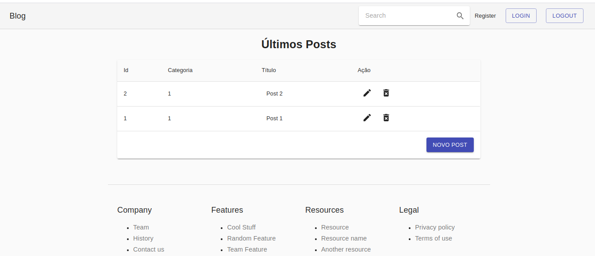
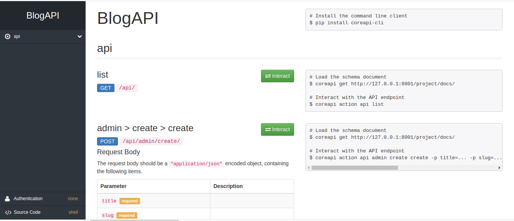

### BLOG - Django Rest-Framework + React

#### This is a small blog project done following VeryAcademy channel tutorial

#### Main objective was to better understand how React frontend communicates with Django RestFramework

#### It includes Django Rest API w/ JWT Authentication and React front-end with CRUD funcions. 

